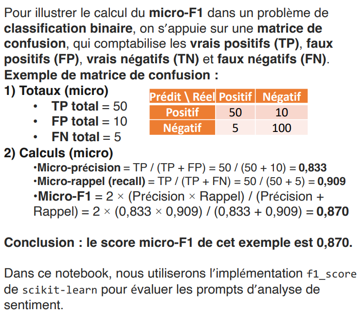
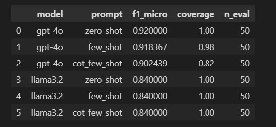

# TP2 - Sentiment Analysis

Projet de classification de sentiment sur des critiques de films IMDb.
L'objectif est de comparer plusieurs strategies de prompting sur un modele de langage et d'evaluer leurs performances avec une metrique robuste.

## Objectif

Ce projet traite un probleme de classification binaire :

- `positive`
- `negative`

Le notebook principal permet de :

- charger et preparer le jeu de donnees IMDb,
- construire des prompts zero-shot, few-shot et chain-of-thought,
- interroger differents modeles de langage,
- comparer les resultats avec le score F1 micro,

- mesurer la robustesse des approches few-shot sur plusieurs tirages.

## Contenu du projet

- `sentiment_analysis.ipynb` : version initiale du notebook.
- `sentiment_analysis_structured.ipynb` : version reorganisee, propre et maintenable.
- `pyproject.toml` : configuration du projet et des dependances.

## Prerequis

- Python `>= 3.13`
- `uv` recommande pour la gestion de l'environnement
- Un acces a OpenAI si vous souhaitez utiliser `gpt-4o`
- Ou bien Ollama installe localement si vous souhaitez tester `llama3.2`

## Installation

1. Cloner le depot ou ouvrir le dossier du projet dans VS Code.
2. Installer les dependances :

```bash
uv sync
```

3. Si vous utilisez OpenAI, definir la variable d'environnement suivante dans un fichier `.env` :

```env
OPENAI_API_KEY=your_api_key_here
```

4. Si vous utilisez Ollama, verifier que le service est lance localement et que le modele est disponible.

## Execution

Ouvrir `sentiment_analysis_structured.ipynb` puis executer les cellules dans l'ordre.


## Methode

Le pipeline suit les etapes suivantes :

1. Chargement du jeu de donnees IMDb.
2. Creation de la colonne `sentiment` a partir du label d'origine.
3. Separation des donnees en :
	- exemples pour le few-shot,
	- exemples d'evaluation (gold set).
4. Construction des prompts :
	- zero-shot,
	- few-shot,
	- few-shot avec reflexion guidee.
5. Evaluation automatique des predictions.
6. Comparaison des performances selon le modele et le prompt.

## Resultats attendus

Le notebook produit un tableau de synthese contenant :

- le nom du modele,
- le type de prompt,
- le score `f1_micro`,
- le taux de couverture,
- le nombre d'exemples evalues.


## Probleme frequents

- Si aucun modele n'apparait, verifier `OPENAI_API_KEY` ou le service Ollama.
- Si `gpt-4o` echoue, verifier l'acces reseau et les credentials.
- Si `llama3.2` echoue, verifier qu'Ollama est lance et que le modele est installe.

